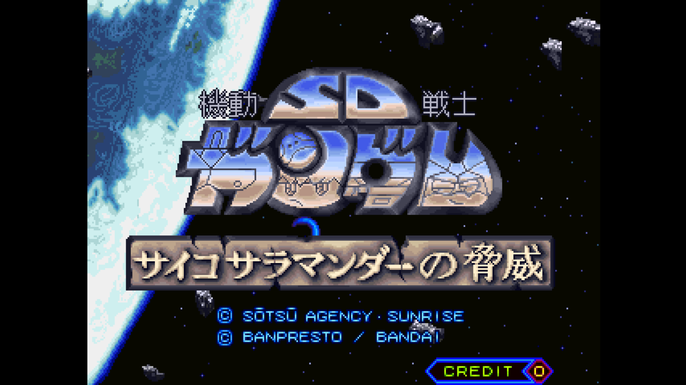
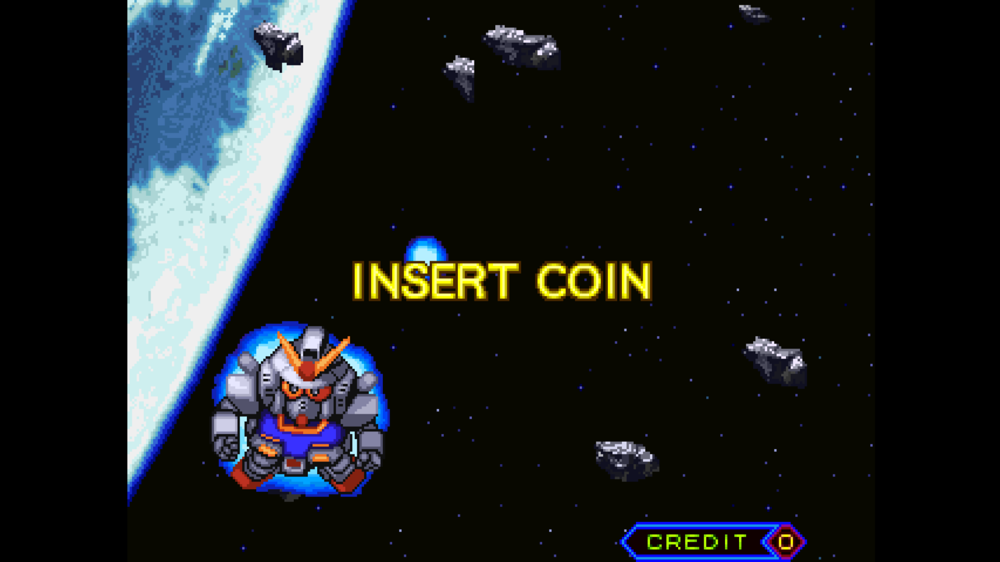
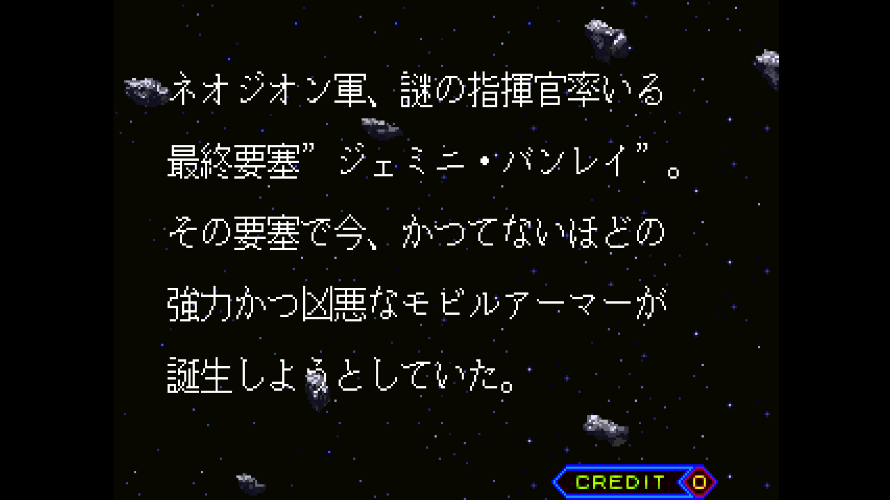
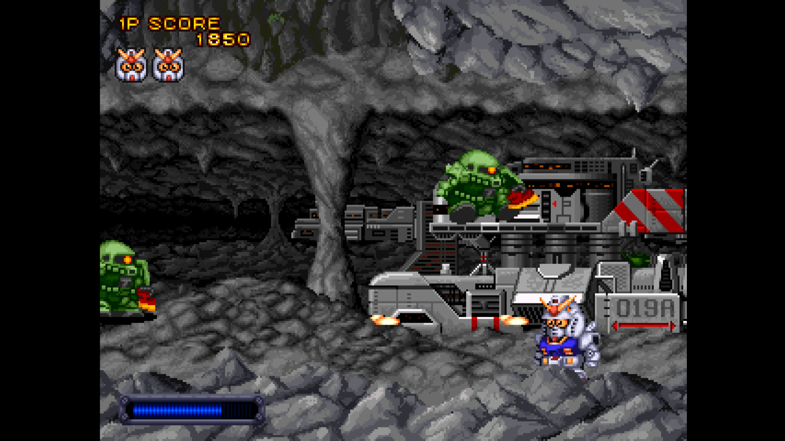
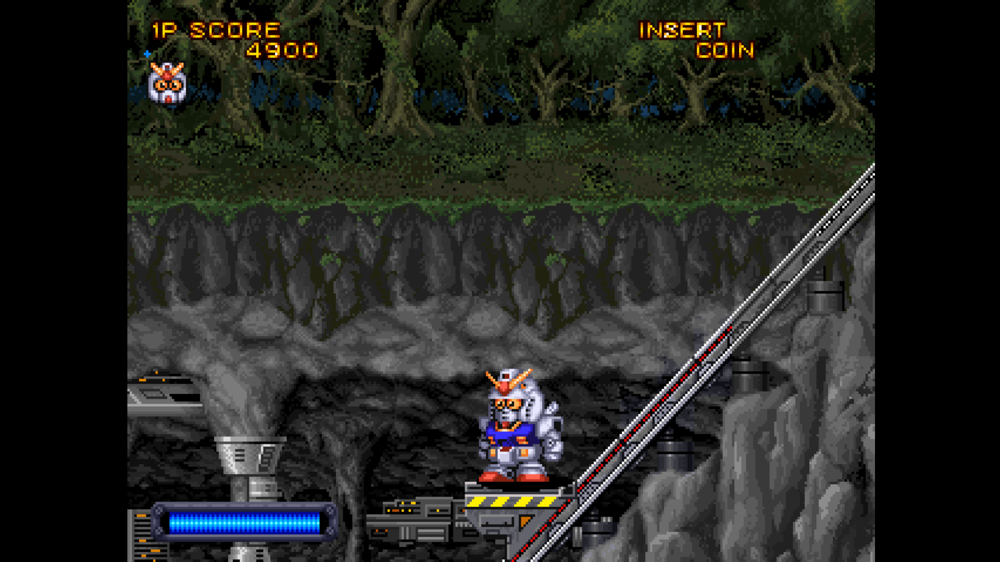
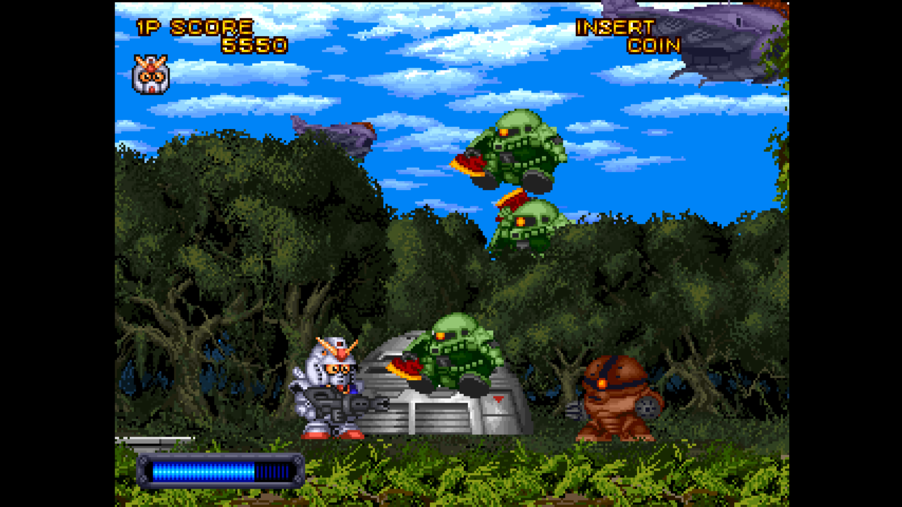

# Arcade-GundamSD_MiSTer

FPGA core for **SD Gundam Psycho Salamander no Kyoui** (Banpresto / Bandai,
1991) targeting the [MiSTer FPGA](https://github.com/MiSTer-devel) platform
(Terasic DE10-Nano).

SD Gundam Psycho Salamander no Kyoui (SD ガンダム サイコサラマンダーの脅威)
runs on **Seibu PB91008** hardware — the same Seibu D-Con family used by
*Blood Bros.* and *D-Con*. This core reimplements the hardware in
SystemVerilog from MAME references (`seibu/dcon.cpp`,
`seibu/seibu_crtc.cpp`), the Seibu CRTC documentation, the main 68000 ROM
disassembly and observation of real PCB behavior.

## About the game

**SD Gundam Psycho Salamander no Kyoui** is a horizontally scrolling
shoot-'em-up starring the super-deformed (SD) Gundam mecha. You pilot a
chibi-proportioned mobile suit through a short, fast-paced campaign, blasting
enemy waves and bosses drawn in the cute *SD* style that Bandai / Banpresto
built a whole franchise around. Under the hood it is pure Seibu D-Con
hardware — three scrolling tilemaps, a text layer and SEI0211 sprites with
priority — the same silicon family behind *Blood Bros.* and *D-Con*, driven
here by a 68000 main CPU and a Z80 + YM2151 + OKI M6295 sound section.

## Status

**Current version: 1.2** (July 2026).

The core runs the full game with audio and inputs, tested on real MiSTer
hardware.

**New in 1.2**
- Analog VGA **CRT Adjust** OSD menu, core-side: **H-Size** (horizontal
  stretch / squeeze), **H-Position** and **V-Shift** for fine alignment on
  15 kHz CRTs — content-shift based, so the sync stays native and the CRT
  never loses lock
- Tile and sprite prefetch **ROM-address / write-address paths pipelined**:
  the long `tile*128` and linebuffer-write adders are split across dedicated
  register stages, so timing closes with positive slack at 96 MHz regardless
  of how the fitter reshuffles placement — no more single-pixel shimmering
  that could appear on some rebuilds
- Video timing constraints corrected: the prefetch FSMs run at full clock
  and are now constrained single-cycle (the earlier multicycle exception was
  masking real paths)

**Milestones reached**
- Full playthrough with accurate video, audio and controls
- MAME-accurate Seibu CRTC (scroll, layer enable, flip screen) and SEI0211
  sprite priority
- BG / MG / FG tilemaps with per-layer scroll and MG gfx-bank
- Analog VGA H-Size / H-Position / V-Shift for CRTs, implemented core-side
- Hardened prefetch datapath: timing closes with positive slack, rock-solid
  pixels across rebuilds

**Roadmap**
- Per-channel audio mixer polish
- Further video accuracy passes
- Additional ROM sets as they are verified

**Features**
- M68000 main CPU @ 10 MHz (FX68K cycle-accurate)
- Z80 sound CPU @ 3.579545 MHz (T80s)
- YM2151 FM (jt51) + OKI M6295 ADPCM (jt6295) with MAME-accurate mixer
- 320×224 active video area (Seibu D-Con timings)
- BG / MG / FG tilemaps (16×16, 4bpp, 32×32 tilemap)
- Text layer (8×8, 4bpp, 64×32 tilemap)
- 16×16 sprites with priority callback (Seibu SEI0211)
- Seibu CRTC registers (scroll, layer enable, flip screen)
- **Analog VGA CRT Adjust** OSD menu — **H-Size** (horizontal stretch /
  squeeze), **H-Position** and **V-Shift** for CRT alignment — see note below
- MiSTer OSD with audio mixer (FM/OKI volume), per-layer debug toggles
- Pause overlay with logo + supporters scroll

### CRT Adjust — the new core-side analog geometry module

**CRT Adjust** is my own module (`rtl/GundamSD/crt_adjust.sv`) and the headline
feature of 1.2. It is the grown-up successor to the earlier core-side
"Analog H-Size" stretch: same content-shift line-buffer idea, now a full CRT
alignment tool. From one always-on line buffer it gives you three live
controls in the OSD:

- **H-Size** — horizontal stretch / squeeze, bidirectional and integer
  (−16 … +15), for filling or pulling in the picture width on a CRT
- **H-Position** — horizontal content shift (−48 … +48 pixels)
- **V-Shift** — vertical line shift (−16 … +15 lines)

The trick that makes it feel great: it moves the picture **content** through
the line buffer while the horizontal and vertical **sync signals stay native**.
The CRT keeps its lock the whole time, so you can slide and resize the image
**live** without the screen rolling, tearing or losing hold — the usual failure
mode when you move the blanking/sync windows instead. The stretch is integer
and line-buffered, so it is **free of shimmering, blending or scaling
artifacts** on the analog output.

Why core-side? A cleaner approach exists as a module inside `sys_top`, where
only the analog DAC is touched and HDMI stays untouched — but the MiSTer-devel
guidelines say the framework (`sys/`) must not be modified. CRT Adjust lives
entirely **core-side** with zero `sys_top` changes, so the core stays fully
compliant. The trade-off: the adjust reaches the analog DAC **and** HDMI
follows it too — so **while CRT Adjust is On you cannot have a clean HDMI image
at the same time as the resize**. Leave CRT Adjust **Off** (default) for an
untouched HDMI output.

**ROM sets supported**
- SD Gundam Psycho Salamander no Kyoui (sdgndmps)

## Screenshots

| | |
|---|---|
|  |  |
| Title screen | Attract — Insert Coin |
|  |  |
| Intro story | Gameplay — cave stage |
|  |  |
| Forest / mountain | Jungle stage |

## Hardware emulated

| Component        | Spec                                                |
|------------------|-----------------------------------------------------|
| Master clock     | 20 MHz crystal (main) + 14.31818 MHz (sound)        |
| Main CPU         | M68000 @ 10 MHz                                     |
| Sound CPU        | Z80 @ 3.579545 MHz                                  |
| Sound chip 1     | Yamaha YM2151 (jt51)                                |
| Sound chip 2     | OKI M6295 (jt6295) ADPCM, pin7=LOW, 1.25 MHz        |
| Video resolution | 320×224 active                                      |
| Refresh rate     | ~59.4 Hz                                            |
| BG layer         | 16×16 4bpp, 32×32 tilemap, scroll X/Y               |
| MG layer         | 16×16 4bpp, 32×32 tilemap, scroll X/Y, gfx-bank     |
| FG layer         | 16×16 4bpp, 32×32 tilemap, scroll X/Y               |
| Text layer       | 8×8 4bpp, 64×32 tilemap                             |
| Sprites          | 16×16 4bpp, 4-level priority (Seibu SEI0211)        |
| Palette          | xBGR_555, 2048 entries                              |
| Custom video CRTC| Seibu CRTC (legionna.cpp / seibu_crtc.cpp)          |
| Sprite chip      | Seibu SEI0211                                       |

## Hardware requirements

- Terasic DE10-Nano
- MiSTer I/O board (recommended)
- Works on HDMI displays and on 15 kHz CRTs via the analog video output

## Notes

- 15 kHz CRT output via the MiSTer analog I/O board works (Seibu D-Con
  320×224 is a standard arcade resolution).
- HDMI output works directly on modern displays. For 31 kHz VGA monitors
  use an HDMI→VGA adapter, or enable **Direct Video** if your I/O board
  and monitor support it.

## Build from source

Requires **Quartus Prime Lite 17.0.x** for Cyclone V (5CSEBA6U23I7).

```bash
cd Arcade-GundamSD_MiSTer
quartus_sh --flow compile SDGundamPS
```

Output: `output_files/SDGundamPS.rbf` (~3.9 MB).

## Running on MiSTer

The [releases/](releases/) folder contains the parent MRA and a
prebuilt RBF:

- `SD Gundam Psycho Salamander no Kyoui.mra` — parent MRA
- `SDGundamPS_20260714.rbf` — prebuilt bitstream (v1.2)

Steps:

1. Copy the `.rbf` to `_Arcade/cores/` on the MiSTer SD card (rename to
   `SDGundamPS.rbf` or keep the dated name and update the MRA accordingly).
2. Copy the `.mra` file to `_Arcade/` on the MiSTer SD card.
3. Provide your legally-owned `sdgndmps.zip` ROM where the MRA expects it
   (usually in `games/mame/`).

**ROMs are NOT included in this repository.** You must provide them yourself.

## Repository layout

```
Arcade-GundamSD_MiSTer/
├── rtl/
│   ├── GundamSD/     SD Gundam-specific core RTL
│   ├── pll/          Clock PLL
│   ├── sound/        Sound chip cores (jt51, jt6295, t80)
│   ├── fx68k/        FX68K M68000 cycle-accurate core
│   ├── jtframe/      JTFRAME framework modules
│   └── sdram.sv      SDRAM controller (Sorgelig)
├── sys/              MiSTer framework (Sorgelig / MiSTer-devel)
├── logo/             Pause overlay assets (font, logo, supporter list)
├── docs/             Screenshots
├── releases/         Parent MRA + prebuilt RBF
├── SDGundamPS.qpf    Quartus project
├── SDGundamPS.qsf    Quartus assignments
├── GundamSD.sv       Top-level wrapper
├── Template.sdc      Timing constraints
├── files.qip         HDL file list
├── build_id.v        Build version stamp
├── LICENSE           GNU GPL v3
├── AUTHORS.md        Credits and third-party licenses
└── README.md         This file
```

## Acknowledgements

- **Jose Tejada** ([@jotego](https://github.com/jotego)) for JT51 (YM2151),
  JT6295 (OKI M6295) and the JTFRAME framework.
- **Daniel Wallner** and **MikeJ** for the T80 (Z80) core.
- **Jorge Cwik** ([ijor](https://github.com/ijor)) for the **FX68K** cycle-accurate
  M68000 core.
- **Sorgelig** and the **MiSTer-devel team** for the framework, SDRAM
  controller and Template.
- The **MAME** project for invaluable hardware reference
  (`seibu/dcon.cpp`, `seibu/seibu_crtc.cpp`).
- **Andrea Bogazzi** ([@asturur](https://github.com/asturur)) for help with the
  core-side **CRT Adjust** module.

## Support this project

If you enjoy this core and want to support its development:

- [Ko-fi](https://ko-fi.com/ibecerivideoludici) — one-time support
- [Patreon](https://www.patreon.com/IBeceriVideoludici) — monthly support
- [PayPal](https://www.paypal.me/IBeceriVideoludici) — one-time donation

## Follow

- [GitHub](https://github.com/rmonic79)
- [Twitch](https://twitch.tv/ibecerivideoludici) — live streams
- [YouTube](https://www.youtube.com/c/IBeceriVideoludici) — playlists and videos
- [X / Twitter](https://x.com/rmonic79)

## License

Distributed under **GNU General Public License v3 or later**.
See [LICENSE](LICENSE) and [AUTHORS.md](AUTHORS.md) for credits and
third-party licensing.

GPL-3 is chosen to stay compatible with upstream GPL-3 dependencies
(JTFRAME, FX68K, Sorgelig's sdram and sys framework).

Original *SD Gundam Psycho Salamander no Kyoui* arcade hardware © Banpresto
/ Bandai / Sunrise / SOTSU AGENCY, 1991. Original ROM data is not included;
users must provide their own legally obtained copies.
